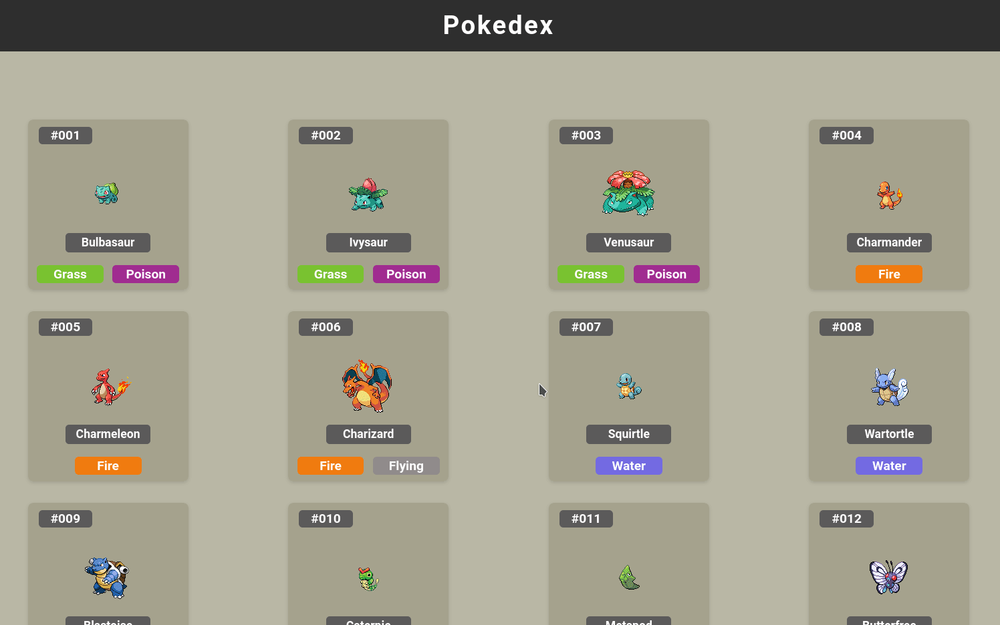
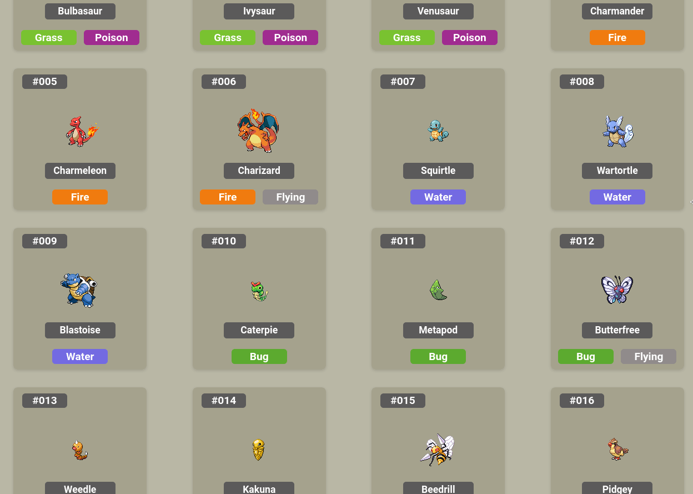

# React Pokedex 

A simple and responsive Pokedex that fetch pokemons from [Poke api](https://pokeapi.co/). This project has been deployed via Netlify. Click [here](https://moscapokedex.netlify.app/) to see a preview.

## What did I use?
* [React](https://reactjs.org/)
* CSS grid and flexbox
* [Axios](https://github.com/axios/axios) to perform asynchronous HTTP requests
* [Poke api](https://pokeapi.co/)
 
 

 
 
